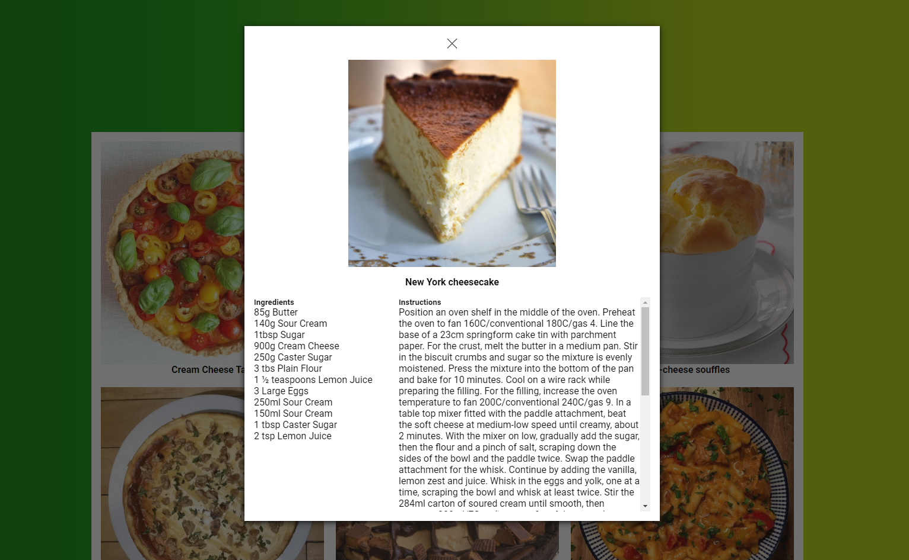

# Meal Finder

An API exercise done during my training at [BeCode](https://becode.org/all-trainings/pedagogical-framework-junior-developer/).

## The Goal

Using the Meal DB API to look for recipes, then display all corresponding recipies and get all the instructions and ingredients when we click on a meal.

## What does it look like ?

Check the result ➡️ [here](https://dystrima.github.io/Meal-Finder/) ⬅️

